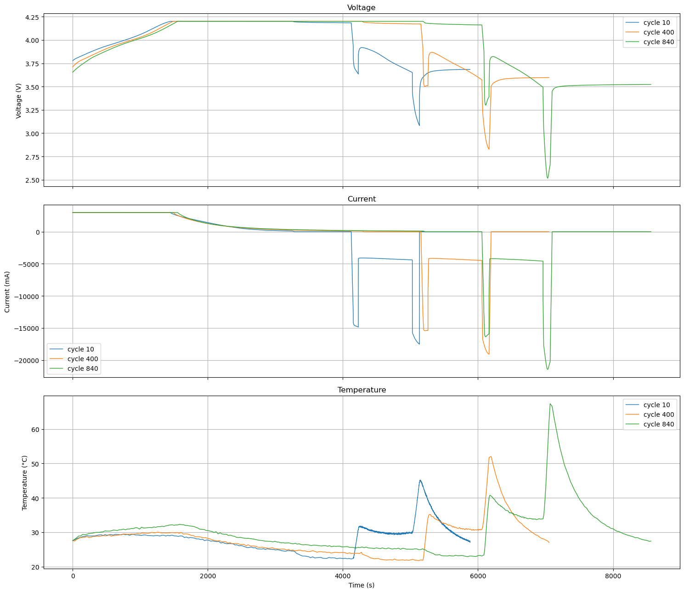

# State of Charge (SOC) estimation for electric Vertical Take-Off and Landing aircraft (eVTOL) batteries

#### 2020199033 김빛나
--------------------
## 1. Introduction

### 1.1 State of Charge of batteries

리튬 이온 배터리는 전기차, 드론, 항공기 등 다양한 시스템에서 사용되는 중요한 에너지 저장 장치이다. 배터리를 안전하고 효율적으로 사용하기 위해서는 현재 배터리에 얼마나 많은 에너지가 남아있는지 정확하게 알아야 한다. 

이때 사용되는 대표적인 지표는 SOC (State of Charge)이다. 이는 배터리의 nominal capacity에 대해 남아있는 capacity의 비로 나타내는데, 남아있는 capacity는 충방전 동안 들어오거나 나간 전류를 시간에 대해 적분함으로써 구할 수 있다. SOC는 0에서 1 사이 값을 가질 수 있으며, 퍼센트로 표기하기도 한다. 

$$
\mathrm{SOC}(t) = \mathrm{SOC}_0 - \frac{\eta \int_{t_0}^{t} i(t)\ dt}{Q_n}
$$

여기서 $\mathrm{SOC}_0$ 은 initial SOC를, $i(t)$는 전류를 의미한다. $\eta$는 efficiency factor이며 배터리의 충방전 과정에서 발생하는 에너지 손실을 반영한다. 실제로 배터리가 노화됨에 따라 $Q_n$이 감소하고, charge/discharge rate, 온도, self-discharge, aging 등의 요소 역시 SOC에 영향을 미치기 때문에 이러한 부분을 고려하여 보정하는 것이 필수적이다. 

  SOC를 정확하게 아는 것은 운행 가능 시간 예측, 시스템 제어, 안전 관리 등을 위해 중요하다. 
그러나 실제 배터리 시스템에서는 SOC를 직접적으로 측정할 수 없다. 배터리에서 실제로 측정 가능한 것은 전압(V), 전류(I), 온도(T)이며, 이를 통해 우리는 SOC를 예측해야 한다.  

실험실 상황이 아닌 실제 배터리 운용 상황에서는 전류 적분에 기반한 SOC 계산에는 한계가 있다. 전류 측정 오차와 센서 노이즈로 인해 SOC의 오차가 시간에 따라 누적되는 문제가 발생할 수 있기 때문이다. 이러한 문제를 보완하기 위해 SOC 추정에 대한 다양한 연구가 진행되었다. 이는 배터리 내부 전기화학적 거동을 수학적으로 묘사하는 물리 기반 모델링과 머신러닝이나 딥러닝을 사용하는 data-driven 모델로 구분할 수 있다. 

----------------------
### 1.2 eVTOL

Electric Vertical Take-Off and Landing (eVTOL) aircraft는 전기 동력을 사용하는 항공기로, Urban Air Mobility의 발전에 따라 주목받고 있다. 기존의 fixed-wing aircraft와 달리 긴 활주로가 불필요하며 수직 이착륙과 호버링이 가능하기에 Automomous deliveries나 air taxies 등의 도심 교통, 응급 항공 서비스 및 기타 단거리 운송 분야에서 적합하다. 

eVTOL의 독특한 주행 특성은 급격하게 변동하는 power를 발생시키며, 이는 배터리 시스템에 큰 stress를 가한다. 또한 전기차(EV)와 비교했을 때 eVTOL은 더 엄격한 배터리 성능을 요구한다. 
이착륙 과정에서는 특히 높은 discharge current가 필요하다. 착륙 시에는 이미 배터리 셀은 소모된 상태에서 성능이 저하된 상태이므로 내부 상태를 파악하는 것이 더욱 까다롭다. 또한 eVTOL은 복잡하고 가변적인 열, 기계적 환경에 노출되며 urban airspace 운용에서는 안전에 대한 요구사항이 더욱 엄격하다. 

eVTOL에서 배터리 관리는 비행 거리, 안전, mission reliability와 같은 핵심 요소를 직접적으로 결정하기 때문에 중요하다. 그러나 복잡한 운용 특성을 가지는 만큼 배터리 내부를 묘사하고 SOC를 예측하기가 어렵고, 기존의 전통적 모델링 방법은 이러한 eVTOL의 운행 상황에 적합하지 않을 수 있다. 그에 따라 현재는 eVTOL 배터리 내부 상태 추정을 위한 모델링 기법에 대한 연구가 활발히 이루어지고 있다. 

-----------------------------------
### 1.3 Project objective
본 프로젝트에서는 eVTOL 배터리의 방전 동안 실시간 적용이 가능한 SOC 예측 모델 구현을 목표로 한다. 

eVTOL 배터리의 SOC는 전압, 전류, 온도에 대해 강한 비선형성을 가지기 때문에 예측하기가 까다롭다. 또한 도심 환경에서 안전하게 사용하기 위해서는 비행 중 실시간으로 SOC를 추정 가능한 모델이 필요하다. 배터리의 실제 사용 중 측정할 수 있는 정보는 전류, 전압, 온도로 제한적이며, 측정 노이즈로 인해 오차가 생길 수 있다. 이를 고려하여 본 프로젝트에서는 Random forest를 활용한 추정을 구현하였다. 

----------------------------
## 2. Data description and Preprocessing

### 2.1 Data description
본 프로젝트에서는 Carnegi Mellon University에서 공개한 eVTOL 배터리 실험 데이터셋을 사용하였다. 

해당 데이터는 eVTOL 항공기의 운용 환경을 모사한 전류 프로파일 하에서 리튬 이온 배터리를 반복적으로 충방전하며 측정된 실험 데이터이다. 

각 실험은 아래와 같이 하나의 mission profile을 기준으로 구성된다. 
1. Constant Current - Constant Voltage (CC-CV) charging
2. Rest 1
3. Take-off
4. Cruise
5. Landing
6. Rest 2

실험에서는 take-off와 landing 구간에서 요구되는 높은 전력을 반영하였다. 또한 배터리의 성능 평가를 위하여 50 cycle 마다 C/5-rate로 방전시키며 Reference Performance Test (RPT)를 수행하였다.

총 22개의 셀에 대해 실험이 수행되었으며, baseline 실험 조건을 기준으로 각 셀은 오직 하나의 조건 (온도, 충전 프로토콜, 비행 프로파일 등)만이 변경되었다. 아래는 데이터 실험 조건의 예시이다. 
- VAH01.csv: basline
- VAH02.csv: cruise time을 1000초로 증가시킴
- VAH05.csv: power reduction 10%

각 파일에서 측정된 데이터의 칼럼명은 다음과 같다. 
- time_s: 누적 시간
- Ecell_V: 배터리의 단자 전압
- I_mA: 전류
- EnergyCharge_W_h, EnergyDischarge_W_h: 충전, 방전 시 들어오거나 나간 에너지량
- QCharge_mA_h, QDischarge_mA_h: 충전, 방전 시 들어오거나 나간 전하량
- cycleNumber: 사이클 넘버
- Ns: cycle segment

공개된 원시 데이터에 대한 자세한 설명은 아래 링크에서 확인할 수 있다. 

https://kilthub.cmu.edu/articles/dataset/eVTOL_Battery_Dataset/14226830

---------------------------
### 2.2 Preprocessing
모델 학습을 위해 다음과 같은 전처리 과정을 수행하였다. 

1) 원본 데이터의 cycle number에 오류가 있어 새로운 cycle number를 부여하였다. (칼럼명: new_cycle)
2) 측정에 오류가 있는 문제 사이클을 구분하고 valid_cycle 칼럼을 추가해 True/False로 표기하였다. 
3) 실제 mission 사이클만 학습시키기 위해 PRT 사이클을 구분하고 RPT_cycle 칼럼을 추가해 True/False로 표기하였다.
4) RPT 직후 사이클은 일반적인 mission 사이클과 진행 양상이 다르기 때문에, after_RPT 칼럼을 추가해 True/False로 표기하였다. 
5) 충방전 시 들어오고 나간 전하량을 이용하여 SOC를 계산하고 SOC 칼럼을 추가하였다.
6) 데이터 측정 과정에서 발생한 SOC의 오류를 보정하여 SOC_shifted 칼럼을 추가하였다.
   

아래 그림은 전처리 후 VAH01 (baseline 조건) 셀의 전압, 전류, 온도 시계열 데이터를 나타낸 것이다. 배터리 aging에 따른 거동 변화를 확인하기 위해 사이클 초기, 중기, 후기 구간을 선택하여 비교하였다. 

아래는 모든 사이클에 대해 계산한 SOC의 그래프이다. 초반 사이클에서 후반 사이클로 진행함에 따라 파란색에서 노란색으로 색을 표현하였다.

-----------------------------------------
## 3. Model and Training step

본 프로젝트에서는 SOC 추정을 위해 Random Forest regressor를 사용하였다. 
eVTOL 배터리의 경우 전압, 전류, 온도와 SOC의 관계가 명확한 선형 모델로 표현되기 어렵기 때문에 모델은 복잡한 비선형 관계를 학습해야 한다. Random forest는 입력 공간을 국소 영역으로 분할하는데, 이러한 비선형성을 효과적으로 포착할 수 있다. 추론 단계에서 계산 복잡도가 낮아 실시간 적용에 적합하기 때문에 SOC 추정 모델로 적합하다. 또한 RF는 별도의 하이퍼파라미터 튜닝 없이도 안정적인 성능을 보이고, 데이터 개수가 많지 않아도 과적합에 강하다는 장점이 있다. 

하나의 데이터 셋은 하나의 배터리 셀에 대해 초기 상태부터 열화가 진행될 때까지의 전체 과정을 포함한다. 따라서 데이터 포인트 단위가 아닌 셀 단위로 train/test split을 적용하였다. 

SOC추정은 RPT 사이클을 제외한 모든 valid한 사이클에 대해 추정된다. RPT 사이클은 배터리 성능 평가를 위해 C/5-rate의 constant current로 천천히 방전되는 구간이기 때문이다. 여기서는 특히 discharge 구간의 SOC 추정에 초점을 맞춘다. Discharge 구간이 eVTOL의 비행 중 구간이며, 해당 구간에서의 SOC가 안전한 운용에 있어서 더 중요하다고 판단하였기 때문이다. 비행 전 eVTOL 배터리는 fully charged 되어 초기 SOC가 1이라고 가정한다. 

3.1의 basic model에서는 SOC 추정을 위해 입력 변수를 전압, 전류, 온도로 사용한다. 전압은 SOC와 가장 직접적인 관계를 가지는 물리량이며, 전류는 방전 상태와 부하 조건을 반영한다. 또한 배터리 내부 저항 및 전기화학 반응은 온도에 크게 의존하므로 온도를 입력변수로 포함하였다. 

이와 같이 추가적인 신호 처리 없이 배터리 사용 중 측정 가능한 기본적인 물리량만을 입력으로 사용하였다. 이는 실제 운용 환경에서의 적용 가능성을 고려한 선택이다. 

3.2의 extend model에서는 전압 변화율과 데이터 포인트의 시간 간격을 추가로 입력 변수로 할당하였다. 

----------------------------------------------------------
### 3.1 Basic model

입력 변수를 다음 세 가지로 설정하였다.
-  Voltage (V)
-  Current (C)
-  Temperature (T)

[Click here to view the notebook](notebooks/Basic_model.ipynb)

----------------------------

### 3.2 Extended model

입력 변수를 다음 다섯 가지로 설정하였다. 
- Voltage
- Current
- Temperature
- dV/dt
- dt

실제 배터리에서 측정되는 단자 전압에는 각 SOC에 따른 open circuit voltage (이상적인 단자 전압), ohmic resistance로 인한 내부 전압 강하, 과거 전류 히스토리에 따른 polarization이 모두 영향을 준다. 이를 고려하기 위하여 전압이 현재 시점에서 어떻게 변화하는지를 모델이 학습하도록 dV/dt를 입력변수로 설정하였다.

또한 본 프로젝트에서 사용한 데이터 분석 결과, 데이터의 측정 간격이 일정하지 않았음을 알 수 있었다. 따라서 입력 변수로 dt를 함께 줌으로써 전압의 변화율이 몇 초 동안 관측된 것인지 모델이 판단할 수 있도록 하였다. 

[Click here to view the notebook](notebooks/Extended_model.ipynb)

----------------------------
## 4. Results and Discussion

### 4.1 Basic model

3.1의 모델을 실행했을 때 결과는 다음과 같다. 

전체 test 셋에 대한 MAE와 RMSE를 구하고, 특히 각 셀에 대한 MAE를 나타내었다. 

아래 그림은 True SOC와 모델이 예측한 SOC 간의 산점도이다.

아래는 한 사이클에서 실제 전류 적분으로 구한 SOC와 모델이 예측한 SOC를 그린 것이다. 그래프를 그린 사이클 번호는 랜덤으로 선택하였다.

실제 SOC가 0.4 - 0.6 부근과 0.8 - 1.0 부근에서 예측 SOC의 오차가 커짐을 확인할 수 있다. 이 구간은 eVTOL이 각각 landing과 take-off를 하는 시점이다. 
eVTOL의 이착륙 구간에서는 셀이 높은 출력을 요구받으며, 이에 따라 전류가 급격히 증가하고 내부 저항 및 과도 응답에 의해 전압의 순간적인 변동이 커진다. 이와 같은 급격한 동적 거동은 SOC 추정을 어렵게 만드는 요인으로 작용한다. 

-------------------------
### 4.2 Extended model

3.2 의 모델을 실행했을 때의 결과는 다음과 같다. 

아래 그림은 True SOC와 모델이 예측한 SOC의 산점도와, 실제 SOC와 모델 예측 SOC 그래프를 그린 것이다. 

4.1의 결과와 비교했을 때, 전압 변화율과 시간 간격을 추가로 고려하면 모델 예측 성능이 향상되었음을 확인할 수 있다. 특히 take-off와 landing과 같이 전류와 전압이 급격히 변화하는 구간에서 예측 오차가 감소하는 경향을 보였다. 이는 전압의 시간적 변화 양상을 함께 반영함으로써, 급격한 변동에 따른 배터리의 동적 거동을 보다 효과적으로 포착할 수 있었기 때문이다. 

-------------------------------------------------
## 5. Conclusion and Discussion
본 프로젝트에서는 eVTOL 배터리의 사용 중 실시간 SOC 추정을 위하여 Random forest regressor을 이용한 머신러닝 모델을 구현하였다. 입력 변수에 따른 모델의 예측 성능 향상을 파악하기 위하여 basic model에서는 V, I, T를 입력 변수로 설정하였고, Extended model에서는 V, I, T, dV/dt, dt을 입력 변수로 설정하였다. 

Basic model의 경우, eVTOL 배터리에서 급격한 전압 강하가 발생하는 이착륙 구간의 SOC 예측의 정확도가 떨어졌으나, Extended model의 경우 이착륙 구간의 SOC를 Basic model에 비해 정확하게 추정할 수 있었다. 

다만 여전히 SOC 추정에 오차가 발생하는 편이므로 향후 연구에서는 이러한 오차를 최소화 할 수 있는 eVTOL 배터리만의 새로운 모델링 기법의 개발이 필요하다. 

향후 연구를 위한 제언은 다음과 같다.

1. 물리 기반 모델과 머신러닝 모델의 결합
   
   전기화학 모델은 배터리 내부의 화학 거동을 수학적으로 표현한 모델이다. 전기화학 모델에서 추정된 배터리의 내부 상태 (ion의 diffusion 등)을 머신러닝 모델의 입력 변수로 활용함으로써, 물리적 해석 가능성과 예측 성능을 동시에 향상시킬 수 있을 것이다.

2. 시간 의존적 모델 (LSTM 등)과의 성능 비교

   본 프로젝트에서는 Random Forest Regressor를 이용하여 비교적 단순하면서도 안정적인 SOC 추정 모델을 구현하였다. 향후 연구에서 시계열 기반 딥러닝 모델을 적용하여 해당 프로젝트 결과와 비교하는 연구를 수행함으로써, eVTOL 배터리의 SOC 추정에 적합한 모델을 만들 수 있을 것이다.

3. EV 배터리 데이터 셋과의 비교
   
   해당 모델이 일반적인 EV 배터리 상황에서 어떤 결과를 보이는지 비교함으로써, eVTOL 배터리 SOC 추정의 오차를 정략적으로 분석하고, 오차의 원인을 상세하게 해석할 수 있을 것이다. 
   
---------------------------------------
## 6. Reference

1. Bills, Alexander, et al. "A battery dataset for electric vertical takeoff and landing aircraft." Scientific Data 10.1 (2023): 344.

2. Zhang, Cheng, et al. "Online estimation of battery equivalent circuit model parameters and state of charge using decoupled least squares technique." Energy 142 (2018): 678-688.

3. Wang, Baoji, et al. "Predicting battery degradation for electric vertical take-off and landing (eVTOL) aircraft: A comprehensive review of methods, challenges, and future trends." ETransportation (2025): 100477.

   
